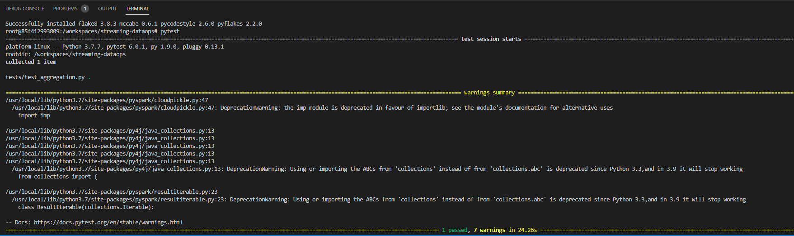

TODO: 
Please see [this task board](https://github.com/NT-D/streaming-dataops/projects/1) in GitHub.

# Streaming data-ops
Sample repo for understanding spark structured streaming data-ops with DataBricks and Azure IoT tools
- You can utilize device simulator in my [GitHub](https://github.com/NT-D/streaming-dataops-device). It can send expected telemetry to IoT Hub and Spark.
- This repo uses [Azure Event Hubs Connector for Apache Spark](https://github.com/Azure/azure-event-hubs-spark) instead of Kafka Connector, because it supports Azure IoT Hubs message property. See more detail in [this blog](https://medium.com/@masayukiota/comparison-kafka-or-event-hubs-connector-to-consume-streaming-data-from-databricks-in-iot-scenario-5053a3d85f4f).

## Motivation (problem statement)
After I see some public documents, I realized there are few documents to describe following things.
- How to write unit test for streaming data in local Spark environment.
- How to automate CI/CD pipeline with DataBricks.

For helping developers to keep their code quality high through testing and pipelines, I want to share how to achieve it.

## Architecture


# How to run app locally
1. If you are new for developing inside a container, please read [this document](https://code.visualstudio.com/docs/remote/containers) and setup environment by refering [Getting started](https://code.visualstudio.com/docs/remote/containers#_getting-started).
1. Clone and open repository inside the container with [this document](https://code.visualstudio.com/docs/remote/containers#_quick-start-open-a-git-repository-or-github-pr-in-an-isolated-container-volume).
1. Set environment variable with event hub (IoT Hub) information
```shell
export EVENTHUB_CONNECTION_STRING="{Your event hub connection string}"
export EVENTHUB_CONSUMER_GROUP="{Your consumer group name}"
```
4. Run `pyspark --packages com.microsoft.azure:azure-eventhubs-spark_2.11:2.3.16 < stream_app.py` in Visual Studio Code terminal to execute structred streaming. It shows telemetry in console.

## environment variable example
|Name|Example|IoT Hub Build-in endpoints name|
|--|--|--|
|EVENTHUB_CONNECTION_STRING|`Endpoint=sb://xxx.servicebus.windows.net/;  SharedAccessKeyName=xxxxx;SharedAccessKey=xxx;EntityPath=xxxx`|Event Hub-compatible endpoint|
|EVENTHUB_CONSUMER_GROUP|Consume group name which you created. Default is `$Default`|Consumer Groups|

- Uses `xxx` for mocking secrets
- Please refer 3rd column to pick up connection setting from Azure IoT Hub's [built-in endpoint](https://docs.microsoft.com/en-us/azure/iot-hub/iot-hub-devguide-messages-read-builtin)

## How to run test locally
In this repo, we uses [pytest](https://docs.pytest.org/en/stable/) for unit testing. If you want to run unit test, please type and run `pytest` in the root folder. You'll see following output in the terminal.


# Setup and run CI/CD pipeline with Azure DataBricks and Azure Devops
Please see [this dotument](./devops/README.md).

# Utilize `pyot` library from Databricks notebook
In the Notebook, app fetches secrets from Azure KeyVault, so you need to setup it at first.
1. Save your `EVENTHUB_CONNECTION_STRING`'s value (Event Hub-compatible endpoint in IoT Hub) as `iot-connection-string` secret in Azure KeyVault. Please refer [this document](https://docs.microsoft.com/en-us/azure/key-vault/secrets/quick-create-portal).
1. Setup Azure Key Vault-backed scope in your Azure DataBricks. Please add `key-vault-secrets` as scope name. Please refer [this document](https://docs.microsoft.com/en-us/azure/databricks/security/secrets/secret-scopes#--create-an-azure-key-vault-backed-secret-scope).
1. Please import `ProcessStreaming.py` under `notebooks` folder to your Databricks and run it on a cluster.


# Reference
## DataOps strategy
For understanding concept of this repo, please read following repo and blog
- [DataOps for the Modern Data Warehouse](https://github.com/Azure-Samples/modern-data-warehouse-dataops)
- [Spark Streaming part 3: DevOps, tools and tests for Spark applications](https://www.adaltas.com/en/2019/06/19/spark-devops-tools-test/)

## Spark structured streaming and Azure Event Hubs
- [Connect your Apache Spark application with Azure Event Hubs](https://docs.microsoft.com/en-us/azure/event-hubs/event-hubs-kafka-spark-tutorial)
- [Structured Streaming + Kafka Integration Guide (Kafka broker version 0.10.0 or higher)](https://spark.apache.org/docs/latest/structured-streaming-kafka-integration.html)
- [Structured Streaming Programming Guide](http://spark.apache.org/docs/latest/structured-streaming-programming-guide.html)


## Unit testing with Spark structred streaming
We have 2 options to test streaming data. One is reading stored file as stream and another is using MemoryStream. Because I can easily generate json file from real streaming data, I selected to use first choice.
- Please see **Streaming Our Data** section in [this document](https://hackersandslackers.com/structured-streaming-in-pyspark/). It describes how to emulate stream
- [Unit Testing Apache Spark Structured Streaming using MemoryStream](https://bartoszgajda.com/2020/04/13/testing-spark-structured-streaming-using-memorystream/)

## Setup development environment
- [Update vscode setting for resolving pyspark import error problem](https://stackoverflow.com/questions/40163106/cannot-find-col-function-in-pyspark)
